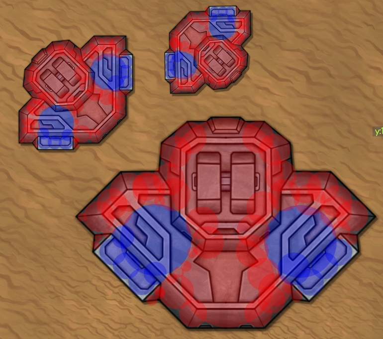

#### Сетевой игровой движок для игр в жанре `action`, `rpg`, `rts`, `tbs`, `tower defense` с видом сверху/изометрией.

Движок не является коробочным решением готовым к использованию и не является конкурентом нормальным движкам. :)

Движок является серверной частью игры решающую вопросы:

- [Сессия, игровое поле, GameLoop](#create-world)
- [Реализация игровых объектов: "юниты", "строения", "пули" и их физическое преставление](#game-objects)
- [Бинарный протокол связи между серверов и клиентом](#binary-protocol)
- [Ввод пользователя](#input)
- [Баллистика, стрельба, слоты для оружия](#weapon)
- [Обнаружение коллизий, реакция на коллизию](#collision)
- [Реализация "Обзора" игроков (создание/обновление игровых обьектов на стороне клиента)](#watch)
- [ИИ](#ai)
- [Поиск пути, управление движением ИИ](#ai-support)

Движок не решает вопросы графики и звука, это лежит на плечах клиента. В данном случае реализован клиент на игровом
движке [Phaser3](https://phaser.io/phaser3), в роли клиента может выступать все что умеет в веб сокеты. (или вообще
любые
сокеты с небольшой переделкой api). Например, хорошим клиентом может стать [Ebitengine](https://ebiten.org/).

#### Игра ["Veliri"](https://yandex.ru/games/app/184316?lang=ru) (Session/MMO/Action) разработана с помощью этого движка:

([ссылка на видео](https://www.youtube.com/watch?v=7D_ILFRQG2MQ))
[](https://www.youtube.com/watch?v=7D_ILFRQG2MQ)

### Как работать с движком:

1) форкаете
2) работаете

### Немного об архитектуре:

Сервер состоит из 3х частей:

- `Роутер` - является посредником между клиентом и нодой. Хранит в себе все игровые сущности и библиотеку с математикой,
  поэтому импортируется как библиотека в ноду.
- `Нода` - это сервис где происходит сама "игра", но 1 ноде может быть много игор.
- `Клиент` - та часть, что видит игрок, является "терминалом" который просто выводит происходящие на экран с помощью
  графического движка.

Для работы сервера необходимо поднять 1 роутер и хотя бы 1 ноду. К одному роутеру может быть подключено много нод что
позволяет горизонтально масштабировать игру.

- Роутер и нода общаются между собой по rpc.
- Роутер и клиент общаются через websocket.


##### Как подключается нода:

1) когда нода запускается
   она, [стучится по rpc](https://github.com/TrashPony/game-engine/blob/master/node/rpc/rpc.go#L56)
   на `veliriURL` указанный в [main.ini](./main.ini)
2) дополнительным аргументом передает параметр `nodeUrl` указанный в [main.ini](./main.ini) (этот аргумент передает ip:
   port машины на которой запущена нода)
3) если соединение успешно,
   то [роутер ловит запрос](https://github.com/TrashPony/game-engine/blob/master/router/rpc/server.go#L65), и
   регистрирует ноду
   в [сторедже нод](https://github.com/TrashPony/game-engine/blob/master/router/mechanics/factories/nodes/nodes.go#L8),
   дает ему uuid и отсылает как ответ.
4) при добавлении ноды в сторедж, роутер
   поднимает [обратный rpc канал](https://github.com/TrashPony/game-engine/blob/master/router/mechanics/factories/nodes/nodes.go#L32)
   на ноду для полнодуплексной связи.
5) когда оба канала открыты, на ноде будут запускаться новые сессии. В случае если на ноде происходит ошибка, или ошибка
   при передаче, или отвал по таймауту то нода удаляется из стореджа.

##### API ноды

Для каждой ноды на роутере есть свое апи выраженные как методы ноды. Посмотреть
можно [тут](https://github.com/TrashPony/game-engine/blob/master/router/mechanics/game_objects/node/node.go#L74)
, нода ловит эти запросы [тут](https://github.com/TrashPony/game-engine/blob/master/node/rpc/rpc.go#L86).

- `CreateBattle` - создает новую сессию
- `FindBattle` - ищет бой по uuid
- `InitBattle` - когда бой создан, игрок запрашивает его состояние при загрузке на клиенте
- `StartLoad` - состояние было успешно получено и игрок запрашивает все обьекты в игре.
- `Input` - ввод игрока (клава/мышь)
- `CreateUnit` - создает юнита игроку инициатору
- `CreateBot` - создает бота в конкретную команду
- `CreateObj` - создает объект (турель), в команду

##### Что посылает нода

Каждая нода [отправляет](https://github.com/TrashPony/game-engine/blob/master/node/rpc/rpc.go#L163) на роутер
данные обновление мира для каждого активного боя. Роутер
их [перенаправляет](https://github.com/TrashPony/game-engine/blob/master/router/rpc/server.go#L81) клиентам по
веб сокетам.

Маршрутизация сообщений для игроков на сокетах происходит
вот [тут](https://github.com/TrashPony/game-engine/blob/master/router/web_socket/sender.go#L75)

### Как запустить:

- поднимаем сервер

```bash
go mod tidy;
go run ./router/main.go;
go run ./node/main.go;
```

- запускаем статику

```bash
cd .\static\;
npm run dev;
#заходим http://localhost:8083/

## ИЛИ
cd .\static\;
npm run build;
#заходим http://localhost:8086/
```

настрока сети на стороне клиента находится
вот [тут](https://github.com/TrashPony/game-engine/blob/master/static/src/const.js) <br>
роутер ловит сообщения сокета вот [тут](https://github.com/TrashPony/game-engine/blob/master/router/main.go#L17)

### ----

<h3 id="create-world">
Сессия, игровое поле, GameLoop
</h3>

Сессию определяет
[объект`Battle`](https://github.com/TrashPony/game-engine/blob/master/router/mechanics/game_objects/battle/battle.go),
но все игровые объекты прикрепляются к
объекту [карты (`Map`)](https://github.com/TrashPony/game-engine/blob/master/router/mechanics/game_objects/map/map.go#L10)
который встроен в `Battle`
.

Все игровые объекты находящиеся на карте (юниты, пули, строения) привязываются к ней
полем `MapID` ([например](https://github.com/TrashPony/game-engine/blob/master/router/mechanics/game_objects/unit/unit.go#L20))
.

[Юниты](https://github.com/TrashPony/game-engine/blob/master/node/mechanics/factories/units/units.go#L8)
и [пули](https://github.com/TrashPony/game-engine/blob/master/node/mechanics/factories/bullets/bullets.go#L9) хранятся в
отдельных стореджах, при добавлении в сторедж,
он [смотрит](https://github.com/TrashPony/game-engine/blob/master/node/mechanics/factories/units/units.go#L56) на
поле `MapID` и кладет в соответствующий массив.

Строения же находятся в
карте [карте (`Map`)](https://github.com/TrashPony/game-engine/blob/master/router/mechanics/game_objects/map/map.go)
.

```go
type Map struct {
// Размер карты в пикселях (все дальности в игре измеряются в пикселях), в идеале квадрат, прямоугольник не тестировался)
XSize        int     `json:"x_size"`
YSize        int     `json:"y_size"`
// текстуры земли, не на что не влияют, нужны только для отрисовки на клиенте.
Flore map[int]map[int]*dynamic_map_object.Flore `json:"flore"`
// Не изменяемые объекты (например горы и овраги), игрок видит эти объекты всегда независимо от радара/обзора и они никогда не изменяются
StaticObjects   map[int]*dynamic_map_object.Object `json:"-"`
// Тут находятся игровые объекты с которыми можно взаимодействовать (убить, построить, передвинуть и тд.), та же эти обьекты могут иметь поведение (например турели).
// Эти объекты игрок видит только когда открыл их в тумане войны. Когда объект ушел обратно в туман игрок запоминает его расположение и состояние.
// Игрок не видит изменения если с объектом вне поле его зрения.
DynamicObjects   []*dynamic_map_object.Object `json:"-"`
// Карта не плоская и у каждой клетке 16x16px есть своя высота (в текущей реализации это влияет только на пули), если она указана то хранится тут если нет то используется DefaultLevel
LevelMap [][]*LvlMap `json:"level_map"`
// высота карты по умолчанию
DefaultLevel float64 `json:"default_level"`
// Кеширование непроходимых участков из-за объектов на карте для ускорения расчета коллизий. Подробнее смотри раздел коллизий.
GeoZones [][]*Zone `json:"-"`
}
```

#### Создание сессии и GameLoop

Создание сессии происходит на ноде при соответствующем запросе
по [rpc](https://github.com/TrashPony/game-engine/blob/master/node/rpc/requests.go#L32).

Когда сессия успешно создана, она попадает
в [сторедж](https://github.com/TrashPony/game-engine/blob/master/node/mechanics/factories/quick_battles/quick_battles.go#L24)
всех сессий на ноде.

Что бы сессия попала в `GameLoop`,
специальный [метод](https://github.com/TrashPony/game-engine/blob/master/node/game_loop/game_loop.go#L29) смотрит все
сессии и если она не инициализирована то запускает её.

`GameLoop` - это игровой цикл который отслеживает и запускает все игровые механизмы (движения объектов, расчеты физики,
обзора,
нанесения урона, пользовательский ввод и все такое). Одна итерация `GameLoop` это 1 кадр на стороне сервера, время этого
кадра ровняется [_const.ServerTick](https://github.com/TrashPony/game-engine/blob/master/router/const/const.go#L9) в мс.

Если итерация отработала
быстрее [_const.ServerTick](https://github.com/TrashPony/game-engine/blob/master/router/const/const.go#L9) то она
вычисляет дельту и спит это время, если дольше то все лагают.

Во время работы итерации собираются сообщения об изменениях или событиях в специальный
объект [web_socket.MessagesStore{}](https://github.com/TrashPony/game-engine/blob/master/node/game_loop/game_loop.go#L53)
.

В конце работы итерации всем
игрокам [отсылаются сообщения](https://github.com/TrashPony/game-engine/blob/master/node/game_loop/send_game_loop_data.go#L16)
предварительно попуская через фильтр видимости.

Подробнее о протоколе и способе обмена данными в
разделе [Бинарный протокол связи между серверов и клиентом](#binary-protocol)

<h3 id="game-objects">
Реализация игровых объектов: "юниты", "строения", "пули"
</h3>

"Юниты", "строения", "пули" - это объекты которые находятся на карте, имеют физическую модель и обрабатываются
в [`GameLoop`](https://github.com/TrashPony/game-engine/blob/master/node/game_loop/game_loop.go).

#### Юниты

Юниты - это объекты, которые перемещаются по карте своим ходом. В игровое представление может быть как танк, так и
человек.

Характеристики юнита определяет
его ["тело"](https://github.com/TrashPony/game-engine/blob/master/router/mechanics/game_objects/body/body.go#L3),
представляет собой куб (длинна, ширина, высота). Параметр `Radius` для быстрого расчетов где не нужна
точность. Тело юнита имеет дальность обзора, слоты под оружие и тип шасси который определяет механику движения.

<br>
<sub>красный квадрат это длинна, ширина. Синий круг `Radius`. Высота влияет на пули.</sub>

```go
type Body struct {
Texture       string              `json:"texture"` // текстура для отрисовки на клиенте.
MaxHP         int                 `json:"max_hp"`
Scale         int                 `json:"scale"`  // сервер заточен на текстуры размером 128х128px, это параметр говорит % от этого размера. Этот параметр влияет на все параметры габаритов и якорей для оружия (подробнее в разделе оружия).
Length        int                 `json:"length"` // длинна полигона (Length * (Scale/100))
Width         int                 `json:"width"`  // ширина полигона (Width * (Scale/100))
Height        int                 `json:"height"` // высота полигона (Height * (Scale/100))
Radius        int                 `json:"radius"` // радиус корпуса для простого расчета колизи в поиске пути
RangeView     int                 `json:"range_view"`  // дальность видимости
RangeRadar    int                 `json:"range_radar"` // дальность радара
Weapons       map[int]*WeaponSlot `json:"weapons"`      // слоты и якоря для оружия (подробнее в разделе оружия)
ChassisType   string              `json:"chassis_type"` // тип шасси, в текущий реализации есть только гусеницы. Можно реализовать свою механику перемещания. (например антиграв, колеса, полет)
Speed         float64             `json:"speed"` // максимальная скорость движения (W)
ReverseSpeed  float64             `json:"-"`     // максимальная скорость движения назад (S)
PowerFactor   float64             `json:"power_factor"`// сила ускорения
ReverseFactor float64             `json:"-"`           // сила ускорения назад (тормоз)
TurnSpeed     float64             `json:"turn_speed"`  // скорость поворота
MoveDrag      float64             `json:"move_drag"` // сила трения при движение
AngularDrag   float64             `json:"-"`         // сила трения при повороте
Weight        float64             `json:"-"`           // вес (влияет на столкновения)
}
```

Параметры связанные с
физикой [перетекают](https://github.com/TrashPony/game-engine/blob/master/router/mechanics/game_objects/unit/physical_model.go#L21)
в
структуру [физической модели](https://github.com/TrashPony/game-engine/blob/master/router/mechanics/game_objects/physical_model/physical_model.go)
при первом обращение к ней.

#### Строения

Строения-это объекты, которые не могут самостоятельно перемещаться или не могут перемещаться вообще. У строений нет "
тела"
как у юнитов. Их физическую модель
представляет [массив](https://github.com/TrashPony/game-engine/blob/master/router/mechanics/game_objects/dynamic_map_object/object.go#L44)
из
непроходимых [точек](https://github.com/TrashPony/game-engine/blob/master/router/mechanics/game_objects/obstacle_point/obstacle_point.go#L7)
.

<br>

При инициализации или движение обьекта геодата собирается в
методе [SetGeoData](https://github.com/TrashPony/game-engine/blob/master/router/mechanics/game_objects/dynamic_map_object/geo_data.go)
и после регестрируется
в [Map.GeoZones](https://github.com/TrashPony/game-engine/blob/master/router/mechanics/game_objects/map/geo_zone.go)

Некоторые строения, как и юниты могут иметь дальность обзора, оружие
и [поведение](https://github.com/TrashPony/game-engine/blob/master/node/game_loop/game_loop_structure/game_loop_structure.go)
.

#### Общее (Юниты/Строения)

В строение и юнитов встроены общие структуры и интерфейсы:

```go 
{
   physicalModel    *physical_model.PhysicalModel          // физическое представление объекта (именно с этой структурой происходит движение, столкновения, пападания пуль)
   gunner           *gunner.Gunner                         // интерфейс для использования оружия
   BurstOfShots     *burst_of_shots.BurstOfShots           // очередь пуль которые вытеют из ствола, у оружия может быть несколько стволов и стрельба очередью
   weaponTarget     *target.Target                         // цель для атаки
   visibleObjects   *visible_objects.VisibleObjectsStore   // обьекты которые "видит", в текущей реализации встраиваается экземляр "комманды"
}
```

Движение юнитов и строений обрабатывается
в `GameLoop` [одним методом](https://github.com/TrashPony/game-engine/blob/master/node/game_loop/game_loop_move/game_loop_move.go)
, [стрельба](https://github.com/TrashPony/game-engine/blob/master/node/mechanics/attack/fire.go#L25)
и [поворот](https://github.com/TrashPony/game-engine/blob/master/node/mechanics/attack/rotate_gun.go#L19) орудий тоже.

#### Пули

[Пуля](https://github.com/TrashPony/game-engine/blob/master/router/mechanics/game_objects/bullet/bullet.go) в игре
представляет из себя шарик
радиусом [_const.AmmoRadius](https://github.com/TrashPony/game-engine/blob/master/router/const/const.go#L7), физика пули
работает на
формулах ["Полета снаряда"](https://en.wikipedia.org/wiki/Projectile_motion) ([реализация](https://github.com/TrashPony/game-engine/blob/master/router/mechanics/game_math/bullet_ballistic.go))
. В зависимости от типа
снаряда ([пуля](https://github.com/TrashPony/game-engine/blob/master/node/mechanics/fly_bullets/fly_bullet.go)
, [лазер](https://github.com/TrashPony/game-engine/blob/master/node/mechanics/fly_bullets/fly_laser.go),
[ракеты](https://github.com/TrashPony/game-engine/blob/master/node/mechanics/fly_bullets/fly_missile.go)) может немного
менять поведение.

Пули в `GameLoop`
обрабатываются [тут](https://github.com/TrashPony/game-engine/blob/master/node/game_loop/game_loop_bullets/game_loop_bullets.go)

<h3 id="binary-protocol">
Бинарный протокол связи между серверов и клиентом
</h3>

#### Сборка сообщений в `GameLoop`

Во время итерации `GameLoop` собираются сообщения которые после будут обработаны и отправлены в роутер.

Сообщения собираются в
объект [MessagesStore](https://github.com/TrashPony/game-engine/blob/master/router/web_socket/sender.go#L12), методом `
AddMsg(typeMsg, typeCheck string, msg web_socket_response.Response, attributes map[string]string)`.

Функция принимает в себя аргументами:

- `typeMsg` - тип сообщения, сообщения одного типа объединяются в 1 длинное сообщение.
- `typeCheck` - определяет функцию, которая будет обрабатывать сообщение.
- [`msg`](https://github.com/TrashPony/game-engine/blob/master/router/mechanics/game_objects/web_socket_response/web_socket_response.go#L3)
  само сообщение, состоит из 2‑х уровней:
    - Метаданные для обработки (например `Х`, `Y` для того что бы проверить видит это сообщение игрок или нет).
    - Сами данные которые будут отправлены игроку, могут быть как бинарные (поле: `BinaryMsg`), так и json (
      поле: `Data`).
      Если BinaryMsg != nil, то считается что это бинарное сообщение и отправится только `BinaryMsg`, иначе
      отправится `Data`.
- `attributes` - какие-то доп атрибуты, которые не уместились в других объектах.

В `GameLoop` большинство сообщений являются бинарными и добавляются примерно одинаково:

```go
MessagesStore.AddMsg("fireMsgs", "bin", web_socket_response.Response{
BinaryMsg: binary_msg.CreateFireGunBinaryMsg(m.TypeID, m.X, m.Y, m.Z, m.Rotate, m.AccumulationPercent),
X:         m.X,
Y:         m.Y,
}, nil)
```

Бинарное сообщение выглядит как набор байт, где 1 байт определяет команду. Остальные байты это информация самого
сообщения. Порядок и значений байт строго определены в сообщение. Все сообщения собираются
вот [тут](https://github.com/TrashPony/game-engine/blob/master/node/binary_msg/binary_msg.go).

Структура сообщения выглядит примерно так: <br>
`[1[eventID], 4[unitID], 4[speed], 4[x], 4[y], 4[z]` - логическое представление <br>
`[0||0,0,0,0||0,0,0,0||0,0,0,0||0,0,0,0||0,0,0,0]`   - массив (это 1 массив) байт который видит машина <br>

- 1[eventID] - 1 байт, eventID - ид команды.
- 4[unitID] - 4 байта, unitID - ид юнита.
- и тд.

#### Обработка сообщений в `GameLoop`

Когда все сообщения
собранны, `GameLoop` [формирует пачки сообщений для каждого игрока](https://github.com/TrashPony/game-engine/blob/master/node/game_loop/send_game_loop_data.go#L16)
. Это нужно для того что бы убирать сообщения,
которые [не видит](https://github.com/TrashPony/game-engine/blob/master/node/game_loop/send_game_loop_data.go#L114)
игрок из-за тумана войны или другой причине.

Когда для игрока формируется пачка сообщений они объединяются
в [одно сообщение](https://github.com/TrashPony/game-engine/blob/master/node/game_loop/send_game_loop_data.go#L52).
Важно что сообщения одного типа идут друг за другом, а не в разнобой, это позволяет указать длину сообщения одного типа,
и размазать его на клиента на много мелких сообщений.

Результатом формирования будет 1 большой сообщение со всеми изменениями мира для 1‑го игрока.
Примерно такого вида:<br>

```
  // [1[eventID],
  //      4[data_size], data[data],
  //      ...
  //      4[data_size], data[data],
```

- 1[eventID] - 1 байт, в данном случае это 100, говорит что это большой пакет данных который надо разобрать.
- 4[data_size] - размер всех сообщений 1‑го типа, то есть это например 100 сообщений типа `fireMsg`, которе в свою
  очередь тоже будится биться на мелки и уже дальше обрабатываться
- ... - и так для каждого типа сообщений.

На клиенте эти сообщений можно
обрабатывать [так](https://github.com/TrashPony/game-engine/blob/master/static/src/store/ws/binary_reader.js#L26):

```js
function parseMegaPackData(data, store) {


    let unitMoveSize = intFromBytes(data.slice(1, 5))
    let stopByte = 5 + unitMoveSize;
    BinaryReader(data.subarray(5, 5 + unitMoveSize), store)

    for (; stopByte < data.length;) {
        let subData = intFromBytes(data.slice(stopByte, stopByte + 4))
        stopByte = 4 + stopByte;
        BinaryReader(data.subarray(stopByte, stopByte + subData), store)
        stopByte = subData + stopByte;
    }
}
```

<h3 id="input">
Ввод пользователя
</h3>

### // TODO

<h3 id="weapon">
Баллистика, стрельба, слоты для оружия
</h3>

### // TODO

<h3 id="collision">
Обнаружение коллизий, реакция на коллизию
</h3>

### // TODO

<h3 id="watch">
Реализация "Обзора" игроков (создание/обновление игровых обьектов на стороне клиента)
</h3>

### // TODO

<h3 id="ai">
ИИ
</h3>

ИИ - основан на "дереве поведения", представлен как бинарным графом.
<br>

За правила поведения отвечает
обьект [BehaviorRules](https://github.com/TrashPony/game-engine/blob/master/router/mechanics/game_objects/behavior_rule/behavior_rule.go)

```go
type BehaviorRules struct {
Rules []*BehaviorRule `json:"rules"` // правла поведения, в данной реализации в массиве всегда 1 стартовое правило.
Meta  *Meta           `json:"meta"` // различные мето данные которые могут влияет на поведение и заполнятся/читаться правилами
}


type BehaviorRule struct { // само правило
Action   string        `json:"action"` // действие которое надо выполнить/проверить.
Meta     *Meta         `json:"meta"`   // у каждого правила тоже есть мета
PassRule *BehaviorRule `json:"access_rule"` // это правло срабатывает в случае успеха
StopRule *BehaviorRule `json:"stop_rule"`   // это правило срабатывает в случает провала
}
```

Правила обрабатываются в [контролере](https://github.com/TrashPony/game-engine/blob/master/node/ai/behavior.go) ИИ на
ноде. Метод `AI` будет рекурсивно вызыватся до тех пор пока аргумент rule не будет nil.

В текущей реализации есть 3 готовых правила: `FindHostileInRangeView`, `FollowAttackTarget`, `Scouting`. Они лежат в
отдельном [пакете](https://github.com/TrashPony/game-engine/tree/master/node/ai/ai_methods), и все новые правила
рекумендуется класть именно туда.

Проверки могут быть самые разнообразные начиная анализом боевой ситуации до проверки полный у бота трюм или можно еще
копать. Например конфигурация простейшего разведчика:

<br>

Правила не имеют ограничений и могут выполнять сразу и порверку и действие. Например метод `FindHostileInRangeView`
найдет врага и бот начнет в него стрелять, но что бы он начал преследовать цель надо выполнить
правило `FollowAttackTarget`. То есть бот нашел врага, вернул `true` и выполнилось следующие правило `rule.PassRule`.

<h3 id="ai-support">
Поиск пути, управление движением ИИ

#### Алгоритм

В основе алгоритма
лежит [А*](https://github.com/TrashPony/game-engine/blob/master/node/mechanics/find_path/find_path.go#L13) с последующим
[поиском прямых отрезков пути](https://github.com/TrashPony/game-engine/blob/master/node/mechanics/find_path/find_path.go#L80)
.
<br>
<sub>зел. - результат А*, желтая линия - путь который пройдет юнит (всего 2 точки).</sub>

#### Как используется

Юнит запрашивает поиск пути 1 раз в "ИИ-тик" (1 сек)
от [сюда](https://github.com/TrashPony/game-engine/blob/master/node/mechanics/find_path/find_path.go#L80), у юнить есть
специальный [объект](https://github.com/TrashPony/game-engine/blob/master/router/mechanics/game_objects/unit/move_path.go)
для кеширования и запросов поиска пути.

```Unit.movePath *MovePath```

```go
type MovePath struct {
path         *[]*coordinate.Coordinate // текущий путь разбитый на части (масив точек которые надо преодолеть).
currentPoint int            // текучая часть пути по которой идет юнит path[currentPoint]
followTarget *target.Target // цель куда стремится юнит
needFindPath bool // запрос на перерасчет пути, если bool то в методе констролера ИИ будет вызван `FindPath`
}
```

Боты создают запросы на поиск пути из методов ИИ напимер что бы преследовать врага или идти на
базу(подробне: [ИИ](#ai)). Для игроков этот метод доступен в методах рпс если игра предполагает управление как в rts/tbs
играх.
При [коллизии](https://github.com/TrashPony/game-engine/blob/master/node/game_loop/game_loop_move/check_move_collision.go#L167)
с другим юнитом или обьектом будет запрощен перерасчет пути до текущей цели.

Когда у Юнита есть заполненный обьект пути через `GameLoop` в методе движения
вызывется [метод](https://github.com/TrashPony/game-engine/blob/9a14249cc5db6fc1b61872bb29c1de60d416153f/node/game_loop/game_loop_move/ai_move.go#L13)
который заставляет юнита двигатся в нужном направление.

Этот метод берет текущий участок пути по которому идет юнит `point := (*path)[currentPoint]`, проверяет достиг ли мы
цели или нет, если достигли то удаляем обьект пути, если не достигли вызваем метод который смотрит в какую сторону
необходлимо следовать юниту и эмуллирует ввод клавишь отвечающий за движение (WASD).

</h3>
